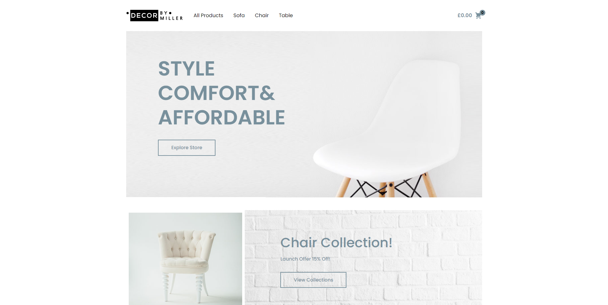

# Furniture E-commerce

The Furniture E-commerce project is a specialized e-commerce platform designed for users looking to shop for furniture. It aims to make furniture shopping easy and enjoyable with a wide range of products, a user-friendly interface.


## Screenshots

[](https://ecommerce-furniture-anrsgrl.netlify.app/)

## Tech Stack
- **JavaScript:** The primary programming language.
- **React:** Utilized for building the user interface.
- **Redux toolkit:** Employed for state management.
- **Bootstrap:** Styling and layout of components.
- **Framer Motion:** Integrated for animations.


## Run Locally

Clone the project

```bash
  git clone https://github.com/Anrsgrl/ecommerce-furniture
```

Go to the project directory

```bash
  cd ecommerce-furniture
```

Install dependencies

```bash
  npm install
```

Start the server

```bash
  npm start
```


## Authors

- [Anrsgrl](https://www.github.com/Anrsgrl)
